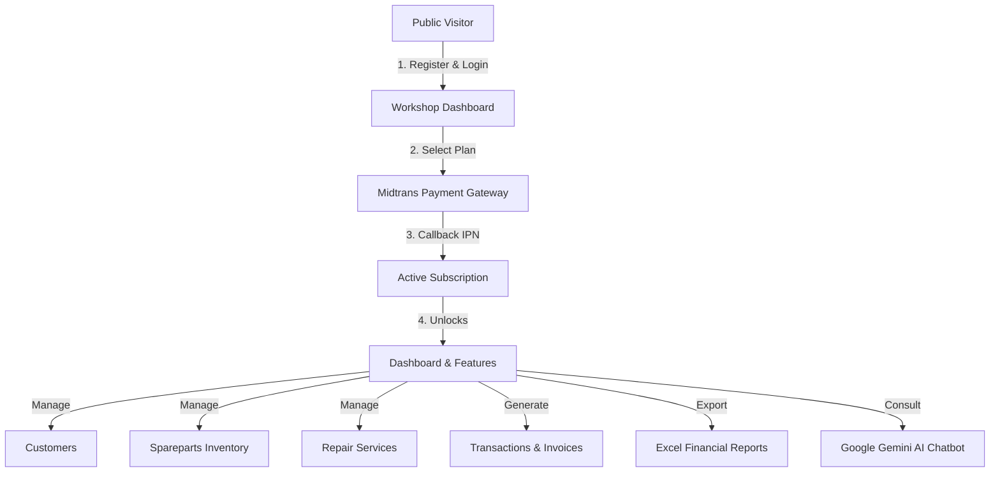

# BengkelSmart 🛠️

[](https://laravel.com)
[](https://php.net)
[](https://filamentphp.com)
[](https://tailwindcss.com)
[](https://midtrans.com)
[](https://deepmind.google/technologies/gemini)

**BengkelSmart** is a modern, cloud-based Software-as-a-Service (SaaS) platform designed for automotive workshop/repair shop management. It streamlines core business operations, including customer relationships, real-time spareparts inventory tracking, repair service workflows, invoicing, subscription-based billing via Midtrans, financial reporting, and an integrated **Google Gemini AI Assistant** that provides smart insights based on live workshop metrics.

---

## 🗺️ System Flow & Architecture

The following diagram illustrates the workflow of the BengkelSmart platform:



---

## ✨ Core Features

*   **💳 SaaS Billing & Subscriptions**:
    *   Tiered subscription plans (Free and Premium).
    *   Secure checkout integration via **Midtrans Snap API**.
    *   Automated subscription state management utilizing Midtrans Webhook/IPN callbacks.
*   **🤖 Google Gemini AI Chatbot**:
    *   Context-aware AI assistant tailored specifically to your workshop.
    *   Automatically pulls live metrics (e.g. today's revenue, low stock spareparts, pending repairs) to answer analytical and advisory questions dynamically.
*   **📦 Inventory & Spareparts Management**:
    *   Track inventory, add stock manually, and receive automated visual alerts when items fall below safety thresholds (low stock warning).
*   **🔧 Repair Service Workflow**:
    *   Manage active repairs with live status updates (Pending, Process, Completed, etc.).
    *   Dynamically associate services with spareparts used and calculate total labor/jasa fees.
*   **🧾 Transactions & Automated Invoicing**:
    *   Generate print-friendly invoices automatically upon service completion.
    *   Process payments and record transactions seamlessly.
*   **📊 Financial & Export Reports**:
    *   Visual dashboard charts tracking monthly service traffic and revenue.
    *   Export comprehensive revenue and transaction histories into Excel (`.xlsx`) format.
*   **🔑 System Admin Panel**:
    *   Robust administrative backend powered by **Filament v4** located at `/admin`.
    *   Allows super admins to manage Plan options, active subscriptions, and registered workshops.

---

## 🛠️ Tech Stack

*   **Backend**: Laravel 12.x (PHP 8.2+)
*   **Frontend**: Tailwind CSS, Blade Templates, JavaScript (Vite)
*   **Administration Panel**: Filament v4 (Filament PHP)
*   **Payment Gateway**: Midtrans PHP SDK (Snap & API integration)
*   **AI Integration**: Google Gemini API
*   **Excel Export**: Maatwebsite Laravel Excel v3
*   **Database & Cache**: MySQL/SQLite, Laravel Cache wrapper

---

## 🚀 Installation & Local Setup

Follow these steps to set up BengkelSmart on your local machine:

### 1. Prerequisites
Ensure you have the following installed:
*   PHP 8.2 or higher
*   Composer
*   Node.js & NPM
*   A local database engine (e.g. MySQL, SQLite)

### 2. Clone the Repository
```bash
git clone https://github.com/your-username/BengkelSmart.git
cd BengkelSmart
```

### 3. Install Dependencies
```bash
composer install
npm install
```

### 4. Configure Environment File
Copy the sample environment file to `.env`:
```bash
cp .env.example .env
```
Open `.env` and fill in your database credentials:
```env
DB_CONNECTION=mysql
DB_HOST=127.0.0.1
DB_PORT=3306
DB_DATABASE=bengkel_smart
DB_USERNAME=root
DB_PASSWORD=
```
Add your **Midtrans** and **Google Gemini** API credentials:
```env
# Midtrans Credentials
MIDTRANS_SERVER_KEY=your_midtrans_server_key
MIDTRANS_CLIENT_KEY=your_midtrans_client_key
MIDTRANS_IS_PRODUCTION=false

# Google Gemini AI
GEMINI_API_KEY=your_google_gemini_api_key
```

### 5. Generate Application Key
```bash
php artisan key:generate
```

### 6. Run Database Migrations & Seeds
Run the migrations along with the database seeder to create the default super admin account:
```bash
php artisan migrate --seed
```

### 7. Build Assets & Start Servers
Start the Laravel development server:
```bash
php artisan serve
```
In another terminal tab, run Vite to compile frontend assets:
```bash
npm run dev
```

---

## 🔑 Default Credentials

### System Admin Panel
You can access the System Admin Panel at `http://localhost:8000/admin`.
*   **Email**: `admin@gmail.com`
*   **Password**: `adminsistem123`

---

## 📄 License

The BengkelSmart software is open-sourced software licensed under the [MIT license](LICENSE).
