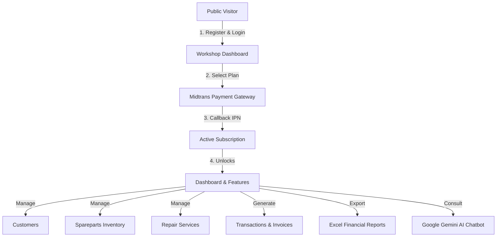

# BengkelSmart 🛠️

[](https://laravel.com)
[](https://php.net)
[](https://filamentphp.com)
[](https://tailwindcss.com)
[](https://midtrans.com)
[](https://deepmind.google/technologies/gemini)

**BengkelSmart** adalah platform SaaS (Software-as-a-Service) modern berbasis cloud yang dirancang untuk manajemen bengkel otomotif. Platform ini menyederhanakan operasi bisnis inti, meliputi hubungan pelanggan, pelacakan stok suku cadang secara real-time, alur kerja servis perbaikan, faktur, penagihan berbasis langganan melalui Midtrans, laporan keuangan, dan **Asisten AI Google Gemini** terintegrasi yang memberikan wawasan cerdas berdasarkan metrik bengkel secara langsung.

---

## 🗺️ Alur Sistem & Arsitektur

Diagram berikut mengilustrasikan alur kerja platform BengkelSmart:



---

## ✨ Fitur Unggulan

- **💳 Tagihan SaaS & Langganan**:
    - Paket langganan berjenjang (Gratis dan Premium).
    - Integrasi checkout aman melalui **Midtrans Snap API**.
    - Pengelolaan status langganan otomatis menggunakan callback Webhook/IPN Midtrans.
- **🤖 Chatbot AI Google Gemini**:
    - Asisten AI yang sadar konteks, disesuaikan khusus untuk bengkel Anda.
    - Secara otomatis mengambil metrik langsung (mis. pendapatan hari ini, stok suku cadang menipis, perbaikan tertunda) untuk menjawab pertanyaan analitis dan konsultatif secara dinamis.
- **📦 Manajemen Inventaris & Suku Cadang**:
    - Lacak inventaris, tambah stok secara manual, dan terima peringatan visual otomatis saat stok di bawah batas aman (peringatan stok menipis).
- **🔧 Alur Kerja Servis Perbaikan**:
    - Kelola perbaikan aktif dengan pembaruan status langsung (Pending, Proses, Selesai, dll).
    - Hubungkan servis dengan suku cadang yang digunakan secara dinamis dan hitung total biaya jasa.
- **🧾 Transaksi & Faktur Otomatis**:
    - Menghasilkan faktur siap cetak secara otomatis saat servis selesai.
    - Proses pembayaran dan catat transaksi dengan mulus.
- **📊 Laporan Keuangan & Ekspor**:
    - Grafik dashboard visual yang melacak tren servis bulanan dan pendapatan.
    - Ekspor rivayat pendapatan dan transaksi ke format Excel (`.xlsx`).
- **🔑 Panel Admin Sistem**:
    - Backend admin berbasis **Filament v4** di `/admin`.
    - Memungkinkan super admin mengelola opsi Paket, langganan aktif, dan bengkel terdaftar.

---

## 🛠️ Tumpukan Teknologi

- **Backend**: Laravel 12.x (PHP 8.2+)
- **Frontend**: Tailwind CSS, Blade Templates, JavaScript (Vite)
- **Panel Administrasi**: Filament v4 (Filament PHP)
- **Gerbang Pembayaran**: Midtrans PHP SDK (Integrasi Snap & API)
- **Integrasi AI**: Google Gemini API
- **Ekspor Excel**: Maatwebsite Laravel Excel v3
- **Database & Cache**: MySQL/SQLite, Laravel Cache wrapper

---

## 🚀 Instalasi & Pengaturan Lokal

Ikuti langkah-langkah berikut untuk menyiapkan BengkelSmart di mesin lokal Anda:

### 1. Prasyarat

Pastikan Anda telah menginstal berikut ini:

- PHP 8.2 atau lebih tinggi
- Composer
- Node.js & NPM
- Mesin database lokal (mis. MySQL, SQLite)

### 2. Kloning Repositori

```bash
git clone https://github.com/your-username/BengkelSmart.git
cd BengkelSmart
```

### 3. Instal Dependensi

```bash
composer install
npm install
```

### 4. Konfigurasi Berkas Environment

Salin file environment contoh ke `.env`:

```bash
cp .env.example .env
```

Buka `.env` dan isi kredensial database Anda:

```env
DB_CONNECTION=mysql
DB_HOST=127.0.0.1
DB_PORT=3306
DB_DATABASE=bengkel_smart
DB_USERNAME=root
DB_PASSWORD=
```

Tambahkan kredensial API **Midtrans** dan **Google Gemini** Anda:

```env
# Kredensial Midtrans
MIDTRANS_SERVER_KEY=your_midtrans_server_key
MIDTRANS_CLIENT_KEY=your_midtrans_client_key
MIDTRANS_IS_PRODUCTION=false

# Google Gemini AI
GEMINI_API_KEY=your_google_gemini_api_key
```

### 5. Generate Kunci Aplikasi

```bash
php artisan key:generate
```

### 6. Jalankan Migrasi & Seeder Database

Jalankan migrasi beserta seeder database untuk membuat akun super admin bawaan:

```bash
php artisan migrate --seed
```

### 7. Build Aset & Mulai Server

Jalankan server pengembangan Laravel:

```bash
php artisan serve
```

Di tab terminal lain, jalankan Vite untuk mengompilasi aset frontend:

```bash
npm run dev
```

---

## 🔑 Kredensial Bawaan

### Panel Admin Sistem

Anda dapat mengakses Panel Admin Sistem di `http://localhost:8000/admin`.

- **Email**: `admin@gmail.com`
- **Password**: `adminsistem123`

---

## 📄 License

Perangkat lunak BengkelSmart adalah perangkat lunak sumber terbuka yang dilisensikan di bawah [lisensi MIT](LICENSE).
